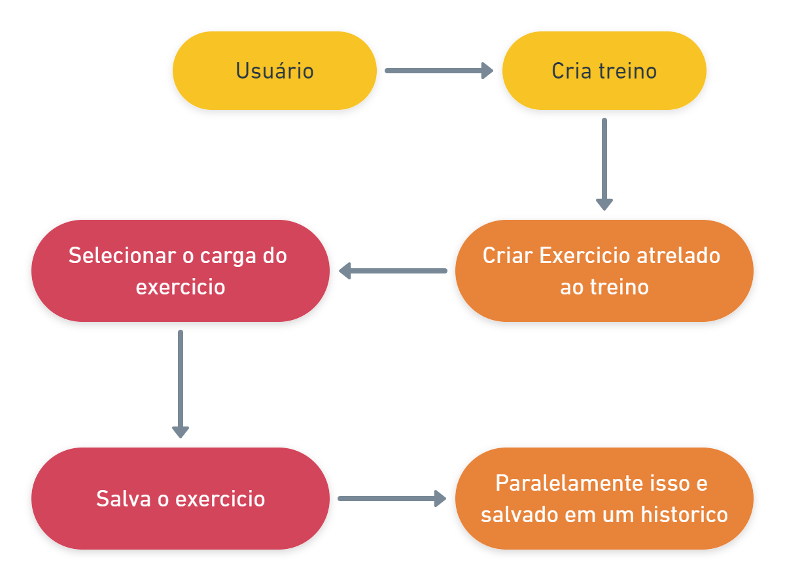

<h1>WayOftheWeights-API 🏋🏽‍♂️<h1>

### Indice 👨‍💻

 <li> <a href="#introdução">1 - 🚪Introdução</a> •</li>
 <li> <a href="#desenvolvimento">2 - ⚙️ Desenvolvimento e Tecnologias</a> • </li>
 <li> <a href="#instalar">3 - 👇🤘 Como instalar</a> • </li>
 <li> <a href="#usar">4 - 🤘Como Usar</a> • </li>
 <li> <a href="#consideraçoesfinais">5 - Considerações finais </a> • </li>
 <li> <a href="#autor">6 -🧑‍💻 Autor</a> • </li>
 <li> <a href="#licensa"> 7- Licença</a> • </li>

## Edições ✏️📑

|             Alterações             |   Data   | Versão |
| :--------------------------------: | :------: | :----: |
| Emissão Inicial | 06/10/22 | 1.0.1  |

<h2 id='introdução' color=green ><b>1 - Introdução</b></h2>

API em desenvolvimento ainda, mas sistema tem o intuito de gestionar as quantidade de **pesos** que alcançado na **academia** pelo usuário

<h2 id='desenvolvimento'><b>2- Desenvolvimento e Tecnologias 🥵🧑‍🏭 </b></h2>

Primeiramente usei a Biblioteca **JEST** e tive problemas para gerar testes em Typescript por causa das configurações, entretanto usei uma nova biblioteca que me surpreendeu. Com suporte a **Typescript**, **Vitest** é uma biblioteca que já possui nativamente suporta Typescript e é extremamente rápido para realizar teste nele. Com sempre o **Arquiterura MVC**, e pela primeira vez realizei um projeto sem nenhuma lógica no banco de dados, 🤦🏽‍♂️Aff como foi difícil abandonar aquelas procedures, enfim extrair um pouco do **Sequelize**, em conjunto com queries nativas, também pela primeira usei as **Migrations** na minha vida🥳 Poor\*\* que ferramenta incrível🤩.

### 👥 Principais Tecnologia usadas até o momento

**• Typescript**
**• PostgresSQL**
**• Express**
**• Sequelize**
**• Nodejs**

<section>  
        
        
        
        
        
</section>

 

Novamente, como sempre como nos projetos anteriores utilizei arquitura **MVC**

<h2 id='instalar'><b>3- Como instalar 🧑‍🔧</b></h2>

<h3><b>DATABASE</b></h3

**ATENCÃO🚨**

Se não quizer usar as **migrações** importe a base de dados que está na pasta /assets/**backup-db-wow-06-10-2022.sql**

**MIGRATIONS**

1. Tenha um **NODEjs** e **PostgresSQL 11** instalado.
2. Clone o projeto.
3. Digite na pasta do projeto npm install.
4. Entre na pasta /database-migrations
5. Crie um .env na /database-migrations com as configuracao abaixo:

                DB_HOST=
                DB_PORT=
                DB_DATABASE=
                DB_USER=
                DB_PASSWORD=
                DB_DIALECT=

Preencha as configurações como o exemplo abaixo:

Exemplo preenchido .env:

                DB_HOST='localhost'
                DB_PORT=5432
                DB_DATABASE='db_wayoftheweights'
                DB_USER='postgres'
                DB_PASSWORD='admin'
                DB_DIALECT='postgres'

6. Digite **npx sequelize-cli db:migrate** dentro da pasta /database-migrations.

7. **ATENÇAO🚨** 

Se ele der algum erro, digite o comando acima novamente.

<h2><b>SISTEMA</b></h2>

7. Após isso crie um **.env** na pasta raiz **/** e configure apontando para sua base de dados. Conforme abaixo ou como sua preferencia :

Exemplo nao preenchido no arquivo .env.example:

                DB_HOST=
                DB_PORT=
                DB_DATABASE=
                DB_USER=
                DB_PASSWORD=
                DB_DIALECT=

                PORT_SERVER=
                TOKEN_SECRET=

Exemplo preenchido .env:

                DB_HOST='localhost'
                DB_PORT=5432
                DB_DATABASE='db_wayoftheweights'
                DB_USER='postgres'
                DB_PASSWORD='admin'
                DB_DIALECT='postgres'

                PORT_SERVER=3000
                TOKEN_SECRET='segredotoken'

8. Após volte para pasta **/** e digite seguinte comando abaixo:

   npm run build

9. Em seguida para roda o projeto digite npm run prod

10 . Dentro da pasta /**assets** há a collection da API chamada **collection_api_har-2022-10-06**, poderá usar para Usar na API de
Teste, **_Insomnia ou postman_** de sua preferencia.

<h2 id='usar'><b>4- Como usar 👩‍💻</b></h2>

Cada usuário tem um treino.
Em cada treino tem vários exercícios
E cada exercício tem a sua carga atual, anteriores, e histórico de performance.
Sendo que cada inserção de exercício pelo usuário, alteração será gravado no histórico do usuário;

Basicamente tem 5 Rotas principais

1. /session = Controlas as sessões de login do usuário.
2. /users = manipula os dados do usuários
3. /statistics = desmostrativos para uso em gráficos.
4. /trainings = Manipulas os treinamento dos usuários
5. /exercice = Os exercícios dentro dos treinamentos.

De uma olhada na documentação para melhor entendimento.

<h3>👉🏽<a href='https://wayoftheweights-docs-api.netlify.app'>Clique aqui para acessa a documentacão</a></h3>

<h2 id='consideraçoesfinais'><b>5 -🥺😭 Considerações finais</b></h2>

Ahhh, mas você já vai ir embora 😢 ...

Com esse projeto pude entender as diferenças dos tipos de **testes** e aplicar um deles, sendo ele de integração.
Visto isso, acho que hoje para realmente temos um software de qualidade e imprescindível criar uma cobertura de testes em suas **APIs**. Creio que como typescript dificilmente vou abandonar essa pratica também. Obrigado a todos!
🤗🙋‍♂️!

### Autor ✍🏻
---

 <b>Joao Guilherme</b></h4> <a href="https://github.com/JoaoG23/">🚀</a>

Feito com 🤭 por Joao Guilherme 👋🏽 Entre em contato!

<h2 id='licenca'><b>7 - Licença</b></h2>

